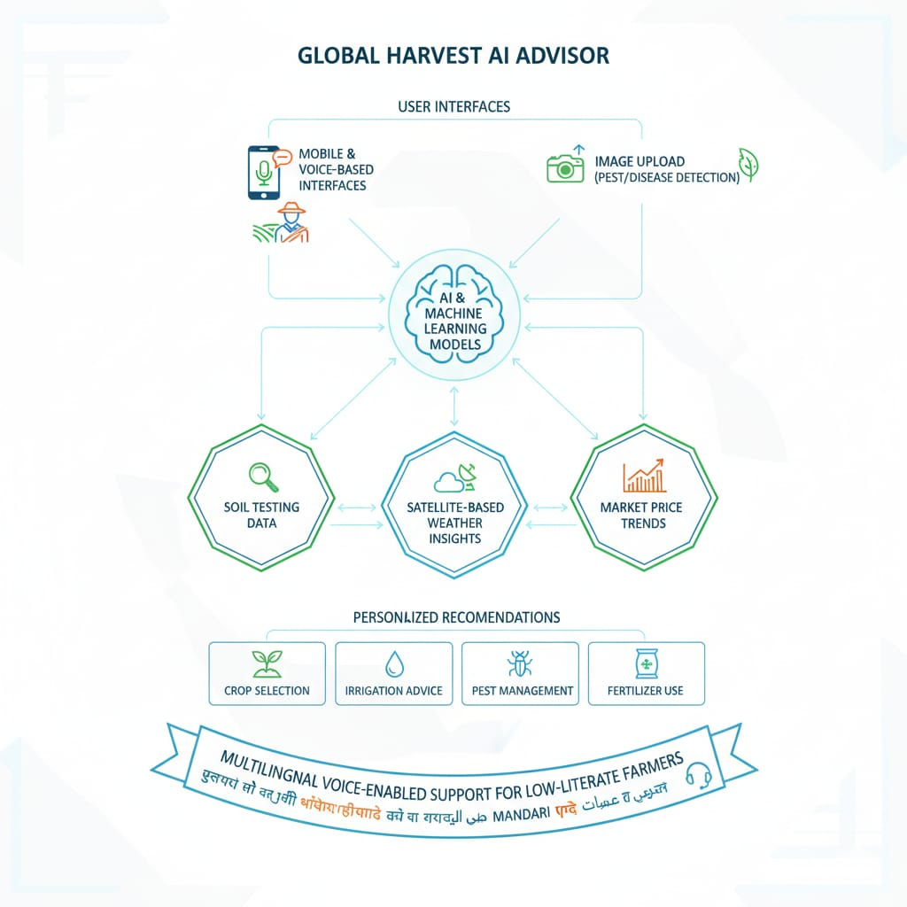

# Smart India Hackathon Workshop
# Date:28.09.2025
## Register Number:25008715
## Name:Ragul.R
## Problem Title
SIH 25010: Smart Crop Advisory System for Small and Marginal Farmers
## Problem Description
A majority of small and marginal farmers in India rely on traditional knowledge, local shopkeepers, or guesswork for crop selection, pest control, and fertilizer use. They lack access to personalized, real-time advisory services that account for soil type, weather conditions, and crop history. This often leads to poor yield, excessive input costs, and environmental degradation due to overuse of chemicals. Language barriers, low digital literacy, and absence of localized tools further limit their access to modern agri-tech resources.

Impact / Why this problem needs to be solved

Helping small farmers make informed decisions can significantly increase productivity, reduce costs, and improve livelihoods. It also contributes to sustainable farming practices, food security, and environmental conservation. A smart advisory solution can empower farmers with scientific insights in their native language and reduce dependency on unreliable third-party advice.

Expected Outcomes

• A multilingual, AI-based mobile app or chatbot that provides real-time, location-specific crop advisory.
• Soil health recommendations and fertilizer guidance.
• Weather-based alerts and predictive insights.
• Pest/disease detection via image uploads.
• Market price tracking.
• Voice support for low-literate users.
• Feedback and usage data collection for continuous improvement.

Relevant Stakeholders / Beneficiaries

• Small and marginal farmers
• Agricultural extension officers
• Government agriculture departments
• NGOs and cooperatives
• Agri-tech startups

Supporting Data

• 86% of Indian farmers are small or marginal (NABARD Report, 2022).
• Studies show ICT-based advisories can increase crop yield by 20–30%.

## Problem Creater's Organization
Government of Punjab

## Theme
Agriculture, FoodTech & Rural Development

## Proposed Solution

## Technical Approach
The advisory system will be developed using modern AI/ML frameworks, cloud-based infrastructure, and mobile technologies. Key technologies include:

Frontend: Flutter/React Native for cross-platform mobile apps

Backend: Python (Django/FastAPI), Node.js

AI/ML: TensorFlow, PyTorch for pest/disease detection and predictive analytics

Database: PostgreSQL/MongoDB for storing farmer and crop data

Cloud: AWS/Azure/Google Cloud for scalability

APIs: Integration with government weather and market price APIs

Voice & Language Support: Natural Language Processing (NLP) with multilingual text-to-speech and speech recognition
The system will follow an iterative development model with pilot testing and farmer feedback for continuous improvement.

## Feasibility and Viability
The solution is feasible due to the availability of affordable smartphones and government-supported agri-tech initiatives. Key challenges include digital literacy, language diversity, and connectivity issues in rural areas. These will be addressed through offline functionality, voice-enabled support, and partnerships with local agricultural officers and NGOs. Continuous updates and AI-based personalization will ensure long-term viability.

## Impact and Benefits
The proposed solution will empower small and marginal farmers by providing reliable, data-driven advisory services.

Social Impact: Better decision-making, improved literacy in digital farming.

Economic Impact: Reduced input costs, higher yield, and better income due to market awareness.

Environmental Impact: Optimized fertilizer and pesticide use, contributing to sustainable farming practices.

## Research and References
www.farmersmartguide.in